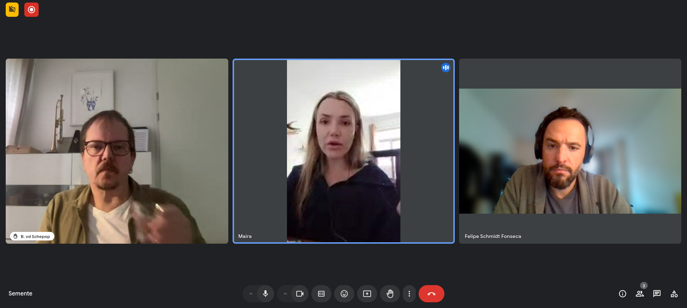

# Workshop #2 - 19/11/2024

Maira, Felipe e Bernardo conversam sobre princípios do projeto: comunidades, circularidade, metáforas e regeneração. Felipe apresentou um rascunho de visualização espiral dos ciclos da semente.

Gravação em vídeo disponível no [Internet Archive](https://archive.org/details/workshop-semente_11-24) and [YouTube](https://www.youtube.com/watch?v=QZ5N1hMrrU4).

Após o workshop, publicamos um texto sobre possíveis entendimentos sobre comunidades e suas implicações.

- [Community Ways](https://semente.de/lab/community-ways/).

## Anotações Felipe

B

Criação de base comum mesmo que temporária.

F

Objetivo do sistema nao é o fruto, mas a manutenção do próprio sistema ao longo do tempo.

Bolsa de sementes - guardar mas multiplicar a sementes. Causo da liderança Guarani Mbya: não é pra guardar, vai lá na tua terra, planta e traz de volta.

Composteira no tempo.

Comercialização ou não.
