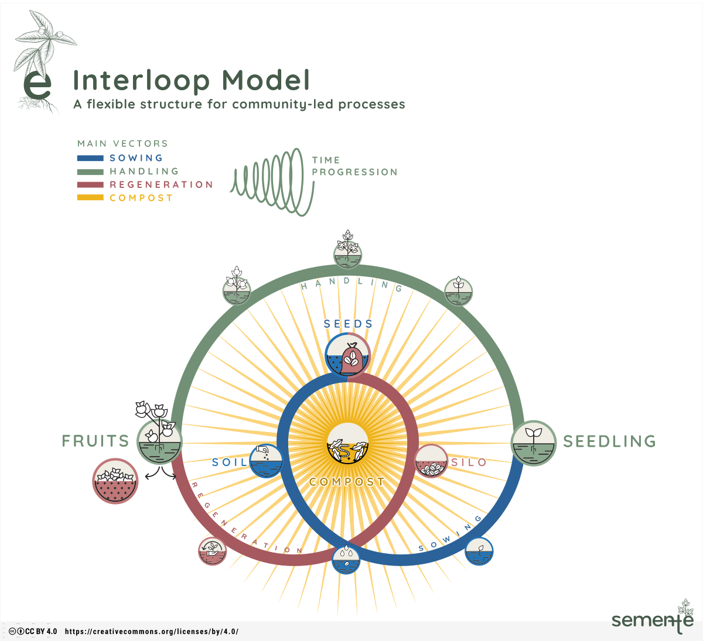

# Semente 0.3

> **Update** on 29/06/2025: a new version of semente is available. It is based on a 3-vector visualisation called [interloop](interloop) and a set of [activation cards](cards). This version replaces all the previous ones and is to be considered the canonical one from now on. semente is available under the [CC-BY](https://creativecommons.org/licenses/by/4.0/) 4.0 licence.

## Process

The third development iteration for semente took place between the end of 2024 and mid-2025 through a series of activities:

- Ongoing [reflecting](reflecting) by the semente team on the toolkit, its shape, and its methods.
- Further development of the semente canvas, mechanics and cards. Early sketches can be found [here](sketching). The final versions can be found on the [interloop](interloop) and [cards](cards) folders.
- A residency in Ubatuba, Brazil with [gaiato](gaiato) in February 2025 and a collaborative workshop in [Instituto Neos](neos).
- Discussion about potential pilot uses of semente.
- Exploration of opportunities for partnerships and public engagement. Documentation of submissions and proposals can be found [here](proposals).

## Goals

For semente 0.3, worked to achieve the following:

- A streamlined version of the semente canvas.
- At least one set of cards.
- A guide and video on the cycle and mechanics of semente: how to understand it.
- An accessible [website](https://semente.de) and comprehensive [documentation](https://github.com/semente-de/documentation) about the development of semente.

Additionally, the *semente LAB* is developing:

- an [open research blog](https://semente.de/lab), including ongoing reflections, references, sketches, experiments, and conversations. Additionally, experimenting with aspects of semente such as cycles, spiral shapes and regeneration, and conducting public conversations in the Tropixel network, documented openly.
- Open-ended experimentation with semente: alternative visions of the toolkit, as well as exchange and pilots with different partners - for instance, with the [Karumbé](karumbe) project and [Neos Institute](neos) in Ubatuba or the [global innovation gathering](gig)).
- An interactive version prototype of semente + documentation.
- Video tutorials and short presentations.

## Outputs

- [Documentation policy](documentation-policy.md).
- [Videos](reflecting/README#Videos) and [blog posts](https://semente.de/lab).
- [gaiato residency documentation](gaiato/).

## Team

The semente team is composed of:

- Bernardo Schepop.
- [Felipe Schmidt Fonseca](https://is.efeefe.me).
- Maira Begalli.

## Network

Semente has at the moment the following partners:

- Rede Afeta, in Brazil.
- University of Bristol.
- gaiato.
- Instituto Neos.