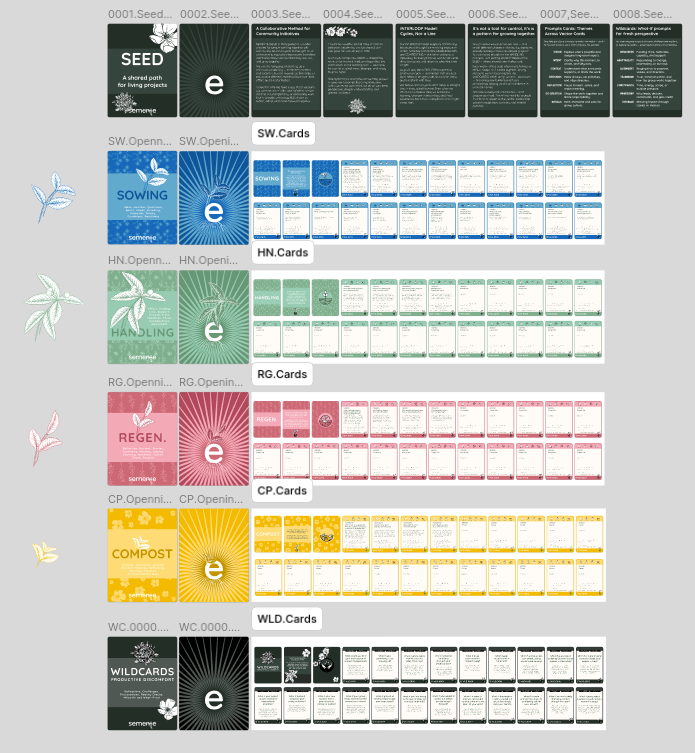
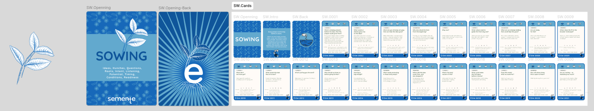
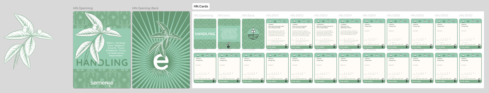
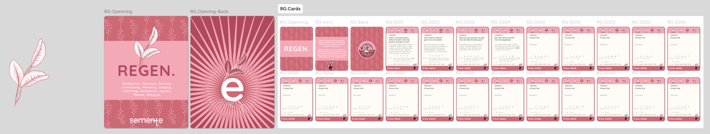
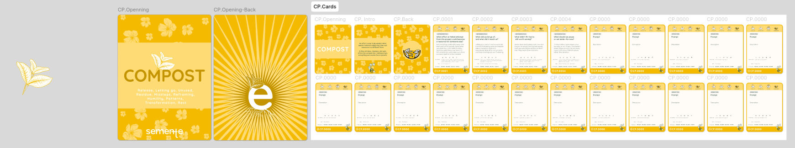
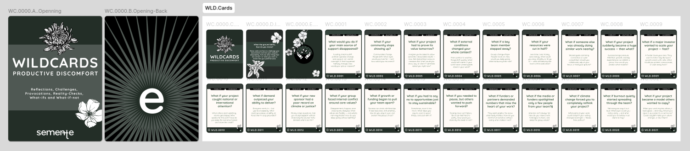

# Cards

The semente cards can be used to activate the [interloop](../interloop) and facilitate deep levels of collective conversation on community initiatives. The first set released in 2025 can be seen below. It's also available from [Figma](https://www.figma.com/design/6UaNh9tnCJpTi8UwRzhslG/Semente-V.4?node-id=0-1&t=BkKnDf2GTIINvvuG-1) under a CC-BY licence 4.0.

## Card types

| Type | What it covers | Includes |
| ----- | ----- | ----- |
| **VISION** | *Explore what’s possible and imagine long-term impact.* | Ideation, narrative, **research**, long-term thinking, context mapping. |
| **INTENT** | *Clarify why this matters, to whom, and why now.* | Mission, personal drive, ethics, principles, and roots of the work. |
| **CONTEXT** | *Understand what surrounds, supports, or limits the work.* | Ecosystem awareness, external shifts, redundancy, timing, risk. |
| **DECISIONS** | *Make choices, set priorities, and align direction.* | Scoping, planning, **metrics as decision inputs**, and roadmapping. |
| **REFLECTION** | *Pause to learn, sense, and make meaning.* | Retrospective, invisible outcomes, **metrics as insight**, storytelling. |
| **CO-CREATION** | *Shape the work together and share responsibility.* | Community, roles, collaboration, partnership, trust. |
| **RITUALS** | *Mark moments and care for group culture.* | Closure, celebration, rhythm, emotional pace, and team dynamics. |

_Many prompt types, especially Vision, Intent, and Context, have a future-facing angle. Use these to imagine what’s next, rehearse possible futures, or explore the seeds of long-term change._

---

## Prompt Cards – Full Deck

### SOWING

Ideas, Hunches, Questions, Roots, Intent, Listening, Potential, Timing, Conditions, Readiness  
Every project starts long before it starts.

Before the work begins, hunches, needs, values, and conditions shape what’s possible. This phase is about noticing what wants to grow and asking if the ground is ready. The SEEDs might be skills, insights, or questions and along this vector is the time of intent, care, and connection.

---

SW.0001 · INTENT

What is already present, before the idea, that this project could grow from?

Every project begins with something: a question, a need, a skill, or a quiet urgency. Look beyond the idea — what values, stories, or existing connections are already in the soil? That’s where the real seed lives.

**For 15 min**: Distribute paper and pencils. Ask each person to write a short reflection on what’s already present in or around them, making this project possible. Then, share in pairs.

**Who**: Anyone connected to the early stages of the work. Especially good for founding teams or new collaborators.

**Related**: SW.0003 • SW.0007 • HN.0001 • RG.0015

---

SW.0002 · VISION

What needs or desires gave rise to this idea?

Ideas don’t grow from nowhere. Explore the conditions, frustrations, or hopes that made this one sprout. Understanding them makes the direction clearer and more rooted.

**For 20 min**: In small groups, ask each person to describe the feeling or story that sparked the idea. Record keywords or emotions on a shared sheet.

**Who**: Project initiators, originators, or those who’ve inherited the idea.

**Related**: SW.0012 • SW.0010 • HN.0008 • RG.0010

---

SW.0003 · VISION

What are you already carrying that can help this idea grow?

Skills, relationships, lived experience, access — these are seeds too. Take inventory of what’s already in your hands before you look for more.

**For 15–20 min.**: Ask each person to write down 3–5 assets they bring to this work. Share in a circle or in pairs. Optional: Build a visible “SEED map” with post-its.

**Who**: Whole team or early working group. Helps surface strengths and unknown capacities.

**Related**: SW.0001 • SW.0007 • HN.0010 • CP.0015

---

SW.0004 · CO-CREATION

Who else should be here from the beginning?

The way you begin shapes what can grow. Who are the voices, communities, or perspectives that belong in the soil, not just in the harvest?

**For 15 min.**: Ask each person to quietly list 2–3 people or groups they think should be involved early. The,n share aloud and cluster common themes.

**Who**: Any project group starting something new. Especially useful to catch blind spots in representation.

**Related**: SW.0020 • HN.0014 • RG.0016 • CP.0020

---

SW.0005 · INTENT

Why now?

What makes this the right season to begin? What’s shifting — in you, the world, or the soil?

**For 15 min**: Invite people to journal or reflect in pairs on “why this, why now?” Prompt a second round: What would happen if you waited instead?

**Who**: Founders or early participants. Useful at moments of pause or restarts.

**Related**: SW.0012 • HN.0008 • RG.0015 • CP.0001

---

SW.0006 · INTENT

What values need to guide this from day one?

Which principles are your roots? Start with what matters — and protect it as you go.

**For 20 min**: Use post-its to name the values each person wants to protect. Group similar values and invite conversation around tensions or priorities.

**Who**: Whole team, especially when values haven’t been discussed aloud.

**Related**: SW.0019 • HN.0015 • RG.0013 • CP.0010

---

SW.0007 · CO-CREATION

What are we already holding that could help this grow?

Think tools, relationships, stories, wisdom — compost from the past that could nourish what’s next.

**For 15 min.:** Invite a quick inventory. What do we already have access to, tangible or intangible? Share responses and note patterns.

**Who**: Team members, especially when resources feel scarce or unclear.

**Related**: SW.0001 • SW.0003 • HN.0007 • RG.0013

---

SW.0008 · CONTEXT

Are we ready for this?

What signs show the ground is ready — in your structure, team, and trust?

**For 20 min.:** Create a “readiness radar” with categories like trust, time, support, and clarity. Rate each category together and discuss where gaps show up.

**Who**: Core group or co-leads. It can also work as a whole-team honesty check.

**Related**: SW.0002 • HN.0005 • RG.0015 • CP.0021

---

SW.0009 · CONTEXT

Where does this fit in the broader landscape?

Zoom out. What’s nearby? Could this connect, clash, or repeat what others are doing?

**For 25 min**: Research sprint\! Invite people to look up similar projects or efforts. Share out: what’s already alive in this space?

**Who**: Anyone. Strong with new team members or as a research warm-up.

**Related**: SW.0010 • CP.0006 • RG.0010 • RG.0016

---

SW.0010 · VISION

What don’t we know yet?

Make space for questions. Curiosity is part of sowing, too.

**For 10–15 min**: On paper or a whiteboard, ask each person to write 1–3 questions they wish they had answered. Cluster and discuss.

**Who**: Any group. Especially good at moments when things feel “decided too soon.”

**Related**: SW.0002 • SW.0013 • RG.0010 • CP.0009

---

SW.0011 · VISION

What would this look like at its best?

Forget deliverables. Describe the dream — the experience, the effect, the culture.

**For 15 min**: Invite a short round of vision sketches (drawing or writing). Share and note common hopes.

**Who**: Open group. Great warm-up for creative or strategic phases.

**Related**: SW.0017 • RG.0008 • RG.0017 • CP.0017

---

SW.0012 · INTENT

What’s pulling you forward?

Is it love, anger, memory, or purpose? Be honest about the roots.

**For 15 min**: Write or speak from the heart, not the plan. Share: What’s pulling you in and holding you back?

**Who**: Core group or individuals with a strong connection to the work.

**Related**: SW.0002 • SW.0005 • RG.0015 • CP.0015

---

SW.0013 · CONTEXT

Who should we listen to before going further?

Whose experience could change how we think about this?

**For 20 min**: Map who’s impacted, who holds insight, who might be invisible. Make a plan to listen before taking the next steps.

**Who**: Any group ready to move beyond internal voices.

**Related**: SW.0010 • HN.0014 • RG.0016 • CP.0011

---

SW.0014 · DECISIONS

How big is big enough?

Not everything must scale. What’s the right size for care and clarity?

**For 15 min**: In pairs or groups, ask “What’s enough for us?” Discuss trade-offs between reach and depth.

**Who**: Any group with ambitions. A grounding moment for planning.

**Related**: HN.0012 • RG.0015 • CP.0017 • CP.0015

---

SW.0015 · CARE → CO-CREATION

What needs protecting in these early steps?

Some things are too fragile to rush. Is it trust, focus, energy, or belief?

**For 15 min**: Everyone writes one thing they’re afraid to lose. Share or post anonymously. Discuss how to protect what matters.

**Who**: Core team, especially during transition or early meetings.

**Related**: HN.0013 • CP.0013 • RG.0014 • CP.0020

---

SW.0016 · REFLECTION

Where did this idea come from, and who shaped it?

No idea grows alone. Trace the influences. Honour the hands that shaped the soil.

**For 20 min**: Story round. Share where the idea came from and who helped shape it: credit people, stories, and even moments.

**Who**: Founders, newcomers, and anyone bridging the past and present.

**Related**: SW.0017 • RG.0001 • RG.0016 • CP.0018

---

SW.0017 · VISION

What’s the bold version of this?

What would this look like in full bloom if nothing stood in the way?

**For 15 min.:** Ask each person to answer, “If this could go beautifully right, what would it look like?” Gather visions aloud or on paper.

**Who**: All participants. Great to open imagination and purpose.

**Related**: SW.0011 • RG.0017 • CP.0015 • RG.0018

---

SW.0018 · CONTEXT

What could make this fall apart before it starts?

Be honest about what’s shaky. Tending starts with seeing.

**For 20 min**: In pairs, share quiet concerns or doubts. Gather themes anonymously and reflect as a group.

**Who**: Any group. Strong early check-in to avoid blind spots.

**Related**: CP.0009 • HN.0010 • RG.0011 • SW.0021

---

SW.0019 · INTENT

Does this match what we stand for?

Hold it up to your core values. Does it belong?

**For 15 min**: Share your group’s values (or write them fresh). Then ask: does this idea honour them? What tensions show up?

**Who**: Whole team or value-holders. Important: before commitments are made.

**Related**: SW.0006 • CP.0010 • RG.0013 • CP.0015

---

SW.0020 · CO-CREATION

How will others know this is open to them?

What signals say: this is yours too?

**For 15 min**: Write down “welcome signals” you’ve seen before. Then brainstorm how this project might invite people in — visibly and meaningfully.

**Who**: Teams designing communications, outreach, or events.

**Related**: SW.0004 • HN.0014 • RG.0016 • CP.0020

---

SW.0021 · RITUALS

Are we rushing — or hesitating too much?

Every seed has its rhythm. What pace helps you feel grounded?

**For 15 min**: Quiet check-in: Are we pushing too fast? Or holding back out of fear? Let people respond on sticky notes or a shared board.

**Who**: Full group or facilitation team. Works well as a tempo reset.

**Related**: HN.0015 • CP.0021 • SW.0018 • RG.0014

---

### HANDLING

Effort, Tending, Care, Support, Growth, Trust, Feedback, Focus, Collaboration, Adjustment

Once an idea is planted, it needs care.

The Handling phase is where things take shape through coordination, feedback, effort, and support. It’s about nurturing what’s growing, letting go of what doesn’t serve, and recognising the signs of early harvest. This is where the work becomes real.

---

HN.0001 · CO-CREATION

What does this project need now to keep growing?

Like a seedling, a project needs care, structure, and the right conditions to take root. This is the moment to check in: what support, roles, or resources are required in order to keep it alive and well?

**For 15–20 min.:** Ask the group to list what the project currently needs: support, skills, tools, and attention. Prioritise the essentials and assign follow-ups if needed.

**Who**: Core team or working group

**Related**: SW.0001 • SW.0007 • RG.0013 • CP.0015

---

HN.0002 · CO-CREATION

How are we nurturing this work — and each other?

Growth isn’t only about progress. It’s also about care, pace, and relationships. Projects thrive when people do too.

**For 20 min.:** Invite reflection on the human side of the project: energy, collaboration, and care. Use check-ins or open dialogue to surface needs or tensions.

**Who**: All active contributors

**Related**: HN.0013 • CP.0013 • SW.0015 • RG.0021

---

HN.0003 · DECISIONS

What do we need to prune for this to stay healthy?

Too much at once can overwhelm a growing project. Sometimes letting go of specific tasks, habits, or ideas is what makes space for real progress.

**For 15 min.:** Review the current scope and tasks. Identify what feels overgrown, misaligned, or energy-draining, and agree on what to cut back on or pause.

**Who**: Project team or coordination group

**Related**: CP.0005 • CP.0017 • HN.0012 • RG.0011

---

HN.0004 · REFLECTION

What fruits are beginning to show?

As work takes shape, it’s essential to pause and recognise what’s emerging. What results, outcomes, or effects are becoming visible, intended or not?

**For 25 minutes,** Ask participants to name what’s already in the soil: needs, skills, values, and stories. Write down keywords or phrases where everyone can see them.

**Who**: Initiators and early collaborators

**Related**: RG.0009 • RG.0010 • SW.0011 • CP.0003

---

HN.0005 · DECISIONS

Do we have what we need to follow through?

Energy, time, support — good ideas need care to become real.

**For 15–20 min**: Invite a short round of honesty. Are we stretched? Energised? What’s missing to move forward well?

**Who**: Any team about to commit, decide, or take action.

**Related**: SW.0008 • HN.0010 • CP.0020 • RG.0015

---

HN.0006 · INTENT

Are we still working toward the same thing?

Projects evolve. So do people. Pause to check if the direction still feels shared.

**For 20 min**: Ask each person to describe the project's purpose in one sentence. Compare answers and discuss any shifts.

**Who**: All contributors, especially after significant changes or during conflict

**Related**: SW.0019 • RG.0013 • CP.0010 • HN.0015

---

HN.0007 · DECISIONS

How much can we realistically hold right now?

Even great plans need time, energy, and support to work. Being honest helps avoid burnout.

**For 20 min.:** Create a shared board with columns for time, energy, and support. Let each person place themselves across the three.

**Who**: Core team or working group

**Related**: SW.0007 • HN.0013 • CP.0020 • RG.0014

---

HN.0008 · INTENT

What’s keeping us going?

Reconnecting to the “why” can bring energy back to the process.

**For 15 min**: Go round and ask: What keeps you showing up? Capture phrases that feel alive.

**Who**: Any group needing a lift or realignment

**Related**: SW.0012 • RG.0015 • CP.0015 • HN.0019

---

HN.0009 · REFLECTION

What are we learning as we go?

Doing the work generates knowledge. Don’t let it slip away unnoticed.

**For 15–20 min**: Ask each person to share one insight they’ve had during the project. Note and collect them as field notes.

**Who**: Whole team. Works well at halfway points or transitions

**Related**: RG.0001 • RG.0010 • CP.0003 • SW.0010

---

HN.0010 · CONTEXT

What warning signs are we ignoring?

Sometimes we sense something’s off — and keep going anyway.

**For 15 min**: Invite a quiet round: what’s one concern you haven’t said out loud? Share and reflect without judgment.

**Who**: Any team. Best used with trust and honesty.

**Related**: SW.0018 • CP.0009 • RG.0011 • HN.0015

---

HN.0011 · CO-CREATION

Are we distributing the work fairly?

Reasonable collaboration shares effort and power, not just tasks.

**For 20 min**: List key roles and tasks on a wall. Review who is doing what and check for imbalance.

**Who**: Coordination groups or the full team

**Related**: HN.0012 • CP.0012 • RG.0012 • SW.0007

---

HN.0012 · DECISIONS

What’s the one thing we must do next?

Clarity in action can prevent confusion and fatigue.

**For 15 min**, Everyone writes what they think is the next most important task. Compare and name the common thread.

**Who**: Teams facing decision overload or juggling too much

**Related**: SW.0014 • CP.0017 • RG.0015 • HN.0011

---

HN.0013 · CO-CREATION

What would rest look like right now?

Pausing isn’t a problem — it’s a pattern of sustainability.

**For 15–20 min.:** Brainstorm ways the group can rest while still honouring commitments. This could involve smaller tasks, flexible roles, or simply stopping.

**Who**: Groups showing signs of fatigue or burnout

**Related**: SW.0015 • RG.0014 • CP.0013 • HN.0002

---

HN.0014 · CO-CREATION

Who’s missing from the room?

Inclusion isn’t automatic. Who’s affected but not represented?

**For 15 min.:** Invite silent reflection and then group brainstorming. Who are we not hearing from, and how might we invite them in?

**Who**: Any group building partnerships or making decisions

**Related**: SW.0004 • SW.0013 • RG.0016 • CP.0020

---

HN.0015 · INTENT

What’s changed since we began?

Adaptation is part of the work. Make space to name what’s shifted.

**For 15 min**: Create a timeline or map of the project so far—Mark moments where direction, values, or team changed.

**Who**: Teams in mid-flow or heading into new phases

**Related**: HN.0006 • SW.0021 • CP.0010 • RG.0013

---

HN.0016 · RITUALS

What moments deserve acknowledgement?

Celebrate progress, closure, or change. Marking moments strengthens the group.

**For 20 min**: Choose a milestone to honour. Design a short ritual: a toast, a word round, or a silent pause.

**Who**: Any group finishing, shifting, or celebrating

**Related**: RG.0003 • RG.0014 • CP.0021 • HN.0004

---

HN.0017 · VISION

How would we describe what’s happening right now?

Stories shape understanding. What’s the story we’re living in today?

**For 15 min**: Invite the group to co-write a short paragraph: “This is where we are.” Compare how each version feels.

**Who**: Any group sensing confusion, change, or opportunity

**Related**: RG.0001 • RG.0008 • CP.0018 • HN.0019

---

HN.0018 · CONTEXT

What external forces are influencing us?

Politics, trends, weather, funding shape what’s possible.

**For 20 min**: Map key external conditions. Circle those creating pressure or possibility. Discuss how you’re adapting.

**Who**: Projects working in complex or shifting contexts

**Related**: RG.0010 • SW.0009 • CP.0006 • RG.0016

---

HN.0019 · INTENT

What kind of culture are we creating?

The way we work becomes part of the outcome.

**For 15 min**: Ask each person to describe the vibe or atmosphere they notice. What’s helpful? What’s in the way?

**Who**: Whole group. Best for long-term or embedded teams

**Related**: SW.0019 • RG.0013 • HN.0015 • CP.0020

---

HN.0020 · DECISIONS

Where are we stretched too thin?

Growth often reveals cracks. It’s better to name them than push through.

**For 15–20 min**: Share a red/yellow/green check-in: How overloaded do you feel? Gather signals and discuss where to reduce pressure.

**Who**: Any group mid-way through demanding work

**Related**: CP.0020 • HN.0007 • HN.0013 • SW.0008

---

HN.0021 · DECISIONS

What can wait?

Knowing what not to do right now is part of wise action.

**For 15 min**: Invite people to name one thing they’re carrying that could be paused. Capture and agree on what to set aside.

**Who**: Teams feeling overwhelmed or entering new phases

**Related**: HN.0012 • CP.0005 • CP.0017 • RG.0011

---

### REGENERATION

Reflection, Harvest, Stories, Continuity, Memory, Legacy, Learning, Handover, Cycles, Reuse

After delivery, we pause to reflect.

What was harvested? What was handed over? What still holds potential?

In Regeneration, we reuse skills, stories, and results, and begin mapping what might come next. This is a time for composting, celebration, handovers, and new seeds.

---

RG.0001 · VISION

What stories are we telling about this project?

Success isn’t always measurable, but it’s always felt. What stories, moments, or signals showed that this work mattered? Which numbers help, and which narratives go beyond them?

**For 20 min**: Invite people to share one story that captures the essence of the work. Write or speak freely. Collect into a single shared reflection.

**Who**: The whole team is instrumental to external guests, sponsors, or documentation.

**Related**: RG.0008 • HN.0017 • SW.0016 • CP.0018

---

RG.0002 · REFLECTION

What outcomes should we store for future use?

Not all results are for now. Some are seeds for later. What knowledge, tools, systems, or connections should we move to the silo for reuse?

**For 25 min**: As a group, list reusable elements — files, ideas, lessons, processes. Agree on where and how to store them.

**Who**: Core team, documentation or continuity roles.

**Related**: RG.0013 • CP.0001 • SW.0007 • HN.0011

---

RG.0003 · CO-CREATION

What needs to be passed on to sponsors or the community?

Good handovers carry not just products, but context and care. What would help others continue the work without confusion or loss?

**For 20 min**: Make a checklist: what should others know to care for what you’ve built? Include the story behind the thing.

**Who**: Outgoing team, sponsors, community leads.

**Related**: RG.0016 • HN.0004 • CP.0020 • CP.0002

---

RG.0004 · REFLECTION

What part of the project feels alive and beating?

Some things pulse with future energy. They’re not finished — just waiting.

**For 15–20 min**: Reflect on what still feels charged or exciting in pairs. Share what you sense is not quite done.

**Who**: Team members or collaborators involved in delivery.

**Related**: RG.0017 • CP.0015 • SW.0017 • CP.0021

---

RG.0005 · REFLECTION

What is one thing you’d do differently next time?

No blame, no regret. Just name the lessons clearly, so next time, they begin stronger.

**For 20 min**: Invite individual reflections: “If I could restart this, I would…” Gather and share patterns.

**Who**: Whole group or subgroup. Great as part of a close-out.

**Related**: RG.0011 • CP.0002 • HN.0010 • SW.0018

---

RG.0006 · REFLECTION

How do we know the work was valuable?

Was something improved, felt, or shifted? Who benefited — and how?

**For 20 min**: Ask: What changed because of this work? Include both small signals and significant outcomes.

**Who**: Whole team, or evaluation group.

**Related**: RG.0009 • CP.0003 • HN.0004 • CP.0014

---

RG.0007 · INTENT

What results could inspire new cycles or spin-offs?

Not all results belong to this project alone. What could spark something new, elsewhere or later?

**For 15–20 min**: Brainstorm possible spin-offs or adaptations. What’s next that builds on what’s here?

**Who**: Founders, team members, collaborators, or funders.

**Related**: RG.0017 • SW.0011 • CP.0015 • CP.0001

---

RG.0008 · VISION

How do we want this work to be remembered?

Stories travel. How this work is remembered can shape what comes next.

**For 25 min**: Write a short “legacy note” — what this project meant and why. Then share and edit together.

**Who**: Anyone connected to the arc of the project.

**Related**: RG.0018 • HN.0017 • CP.0018 • SW.0016

---

RG.0009 · RITUALS

What deserves acknowledgement or closure?

Marking endings can bring gratitude, clarity, and peace.

**For 15–20 min**: Design a closing gesture: word round, meal, gift, or silence. Make it feel sincere.

**Who**: Full team, partners, or community members.

**Related**: RG.0014 • CP.0021 • HN.0016 • CP.0002

---

RG.0010 · CONTEXT

What happened that we didn’t expect?

Surprise is a teacher, too. What emerged outside your plan?

**For 15 min**: Ask each person to name one unexpected twist or result. Map or group these learnings.

**Who**: Anyone who contributed or observed.

**Related**: SW.0010 • HN.0009 • CP.0003 • RG.0012

---

RG.0011 · REFLECTION

What do we need to compost?

Not everything goes forward. Some things are better transformed than preserved.

**For 20 min.:** Make a list of what no longer serves. Thank it, and then let it rest.

**Who**: Whole team or coordination group.

**Related**: CP.0001 • CP.0005 • RG.0005 • HN.0021

---

RG.0012 · CO-CREATION

Who did we grow alongside?

Projects shape relationships. Take time to name who you connected with or learned from.

**For 15 min**: Draw a web of people and partners involved. Highlight where growth or closeness happened.

**Who**: All participants.

**Related**: HN.0011 • SW.0004 • RG.0016 • CP.0020

---

RG.0013 · INTENT

Do our values still feel true?

Values can evolve — or be affirmed. What feels steady, and what feels different?

**For 20 min**: Return to early intentions or value statements. Reflect on whether they still feel aligned.

**Who**: Whole team, especially at project close or restart.

**Related**: SW.0006 • HN.0006 • CP.0010 • RG.0019

---

RG.0014 · RITUALS

Who needs rest, and how will we support that?

After intensity, people need recovery. Make it okay to step back.

**For 15 min.:** Ask openly, "What would rest look like now?" Plan rest with the same care you plan work.

**Who**: Full team or leadership.

**Related**: HN.0013 • SW.0015 • CP.0013 • CP.0020

---

RG.0015 · INTENT

What did this work prepare us for?

Sometimes endings are beginnings. What are we now more ready to attempt?

**For 20 min**: Ask: What do you feel more capable of now — personally or collectively?

**Who**: Anyone who participated with commitment.

**Related**: SW.0012 • HN.0008 • CP.0015 • RG.0004

---

RG.0016 · CO-CREATION

Who else could benefit from what we’ve learned?

Knowledge travels farther when shared.

**For 25 min**: Identify groups, peers, or movements that might use what you’ve learned. Make a plan to share or publish.

**Who**: Coordination or learning leads.

**Related**: RG.0003 • SW.0013 • HN.0014 • CP.0006

---

RG.0017 · INTENT

What could grow from this next?

Every end is a seed. What’s quietly waiting to emerge?

**For 20 min.:** Invite the group to share what they feel they might want to grow next—new projects, partnerships, roles.

**Who**: Whole team or core contributors

**Related**: RG.0004 • RG.0007 • CP.0015 • SW.0017

---

RG.0018 · VISION

What story do we want others to tell about this work?

Sometimes you don’t write your ending. What narrative would you want others to hold?

**For 20 min**: Write “the story we hope is told in small groups.” Share and shape a collective version.

**Who**: Full group, especially for public work.

**Related**: RG.0008 • HN.0017 • CP.0018 • SW.0011

---

RG.0019 · CO-CREATION

What relationships do we want to maintain?

Not all ties end with a project.

**For 15 min.:** Review your network. Who do you want to stay in touch with, and how?

**Who**: Group members with strong collaborative ties.

**Related**: RG.0013 • RG.0012 • HN.0014 • CP.0020

---

RG.0020 · DECISIONS

What are we now more ready for?

Finishing something often unlocks new skills or vision.

**For 15 min**: Ask each person to name one thing they now feel more equipped to do. Reflect on growth.

**Who**: Whole group or learning participants

**Related**: RG.0015 • HN.0005 • SW.0003 • CP.0015

---

RG.0021 · RITUALS

How do we take care of what’s been built?

Some things are fragile. Regeneration also means stewardship.

**For 20 min.:** Identify what needs ongoing care: a relationship, a platform, or a practice. Decide how to support it moving forward.

**Who**: Coordination team, community stewards, or whole group

**Related**: RG.0014 • HN.0020 • SW.0015 • CP.0020

---

### COMPOSTER

Release, Letting go, Unused, Residue, Missteps, Reframing, Humility, Patterns, Transformation, Rest

No project is perfect or unfolds in a straight line.

Even the missteps, side paths, and half-formed ideas may hold value. They might not serve you now, but they could spark insight for someone else later. Don’t discard them — compost them. Composting is about reflection, release, and transformation.

---

CP.0001 · REFLECTION

What effort or failed attempt could still hold value later?

Let it rest. Some ideas just need different timing or context. What didn’t serve today might be treasured tomorrow. Compost it with care.

**For 15 min.:** Ask the group to name ideas, tasks, or efforts that haven’t gone anywhere yet. Record them in a “compost” list for future reuse.

**Who**: The whole group is at the project close or reflection point.

**Related**: RG.0011 • RG.0007 • SW.0007 • RG.0004

---

CP.0002 · REFLECTION

What are we letting go of — and why?

Not everything needs to be finished. Releasing something can be a sign of clarity, not failure.

**For 15 min**: Invite each person to write down one thing they’re ready to stop. Share the reasoning, if they wish.

**Who**: Any project group that reflects together.

**Related**: RG.0005 • CP.0005 • HN.0003 • RG.0009

---

CP.0003 · DECISIONS

What impact did we forget to measure?

Not all value fits into a spreadsheet. What signs of success went unrecorded — moments, emotions, shifts?

**For 20 min.:** Ask the group to share “invisible outcomes” and capture them in a shared document or visual.

**Who**: Learning, monitoring, or storytelling roles.

**Related**: HN.0009 • RG.0006 • RG.0010 • CP.0014

---

CP.0004 · CO-CREATION

What miscommunication keeps surfacing?

Sometimes it’s not the people — it’s the pattern. Composting can mean naming what didn’t quite click.

**For 20 min**: In small groups, reflect on any repeated misunderstandings. What might they reveal about assumptions or systems?

**Who**: Any working team, especially those continuing together.

**Related**: HN.0011 • CP.0012 • CP.0011 • HN.0001

---

CP.0005 · DECISIONS

What parts of the work are no longer needed?

Good composting is pruning. Let go of what’s taking energy without return, even if it once made sense.

**For 15 min**: As a group, list tasks or ideas that now feel unnecessary. Honour them — then release.

**Who**: Coordination teams or project managers.

**Related**: HN.0003 • RG.0011 • CP.0017 • HN.0021

---

CP.0006 · CONTEXT

Where did we repeat efforts that were already done elsewhere?

Sometimes we reinvent the wheel. Notice it — and compost the extra.

**For 20 min**: Identify duplicated work. Ask what systems or research might have prevented it.

**Who**: Delivery teams, researchers, or strategists.

**Related**: SW.0009 • HN.0018 • RG.0016 • CP.0019

---

CP.0007 · INTENT

What assumptions no longer serve us?

Projects carry invisible beliefs. Some stop helping. Let’s name and release them.

**For 15 min**: Ask the group to reflect: “What belief shaped this project that we now see differently?”

**Who**: All contributors, especially those designing what’s next.

**Related**: SW.0019 • CP.0015 • RG.0013 • SW.0005

---

CP.0008 · VISION

What didn’t make the final story — but still matters?

Some things don’t fit into the case study or report, but they shaped the process profoundly.

**For 20 min**: Ask: “What’s something true about this project we don’t usually discuss?” Share and honour.

**Who**: Project team or storytellers.

**Related**: RG.0018 • HN.0017 • CP.0018 • SW.0016

---

CP.0009 · REFLECTION

What feedback did we ignore or avoid?

Feedback isn’t always easy — or timely. What might be worth revisiting?

**For 15 min**: Ask: “Was there a piece of input we didn’t listen to that now feels more relevant?”

**Who**: Leads or whole team. Suitable for a post-project review.

**Related**: SW.0018 • HN.0010 • RG.0010 • CP.0011

---

CP.0010 · INTENT

Where did we drift from our values?

Drift happens. What moments made you pause — or should have?

**For 20 min.:** Revisit your values, mark where alignment frayed, and discuss how to prevent it next time.

**Who**: All team members, especially those holding culture or ethics.

**Related**: SW.0006 • HN.0006 • RG.0013 • SW.0019

---

CP.0011 · CO-CREATION

What tensions never got fully named?

Unspoken tensions can shape everything. Naming them can be a release.

**For 20 min**: Invite silent writing: “What was hard to talk about?” Share themes anonymously, then discuss openly.

**Who**: Whole group with high trust, or a trusted subgroup.

**Related**: CP.0004 • CP.0009 • HN.0014 • RG.0011

---

CP.0012 · CO-CREATION

What roles caused confusion or overlap?

Structure is part of compost, too. What roles, titles, or tasks blurred lines?

**For 15 min**: Review roles and tasks from the project. What caused repeated friction?

**Who**: Coordination group or process team.

**Related**: CP.0004 • HN.0011 • CP.0011 • SW.0007

---

CP.0013 · CO-CREATION

What did we neglect — and why?

Sometimes care slips. Acknowledge what was missed and why.

**For 20 min**: Ask: “What or who didn’t get the attention they needed?” Reflect on the impact.

**Who**: Any reflective team, especially during slowdowns or recovery.

**Related**: HN.0013 • SW.0015 • RG.0014 • CP.0020

---

CP.0014 · DECISIONS

What did we track that didn’t matter in the end?

Sometimes we measure what’s easy, not what counts.

**For 15 min**: Review indicators or goals. Which ones felt hollow in hindsight?

**Who**: Learning, impact, or strategy roles.

**Related**: CP.0003 • RG.0006 • HN.0009 • CP.0017

---

CP.0015 · INTENT

What did we chase that wasn’t truly ours?

Sometimes we follow someone else’s vision. Composting means letting go of what was never ours to begin with.

**For 20 min**: Reflect as a group: “When did we say yes just to stay afloat — or be seen?”

**Who**: Core team, funders, and partners.

**Related**: RG.0015 • SW.0012 • SW.0017 • RG.0017

---

CP.0016 · REFLECTION

What emotional residue are we carrying?

Even with success, some parts are complex. Composting includes feelings.

**For 15–20 min**: Ask: “What are you still holding?” Give space for honest, gentle sharing.

**Who**: Any team finishing something meaningful or intense.

**Related**: RG.0005 • RG.0011 • HN.0013 • CP.0021

---

CP.0017 · DECISIONS

What got deprioritised for the wrong reasons?

Some things were dropped too quickly — or for reasons that deserve review.

**For 15 min**: Make a list of dropped ideas. Which ones might still be worth revisiting later?

**Who**: Full team, especially at handover or evaluation.

**Related**: CP.0005 • CP.0014 • HN.0012 • RG.0004

---

CP.0018 · VISION

What parts of the story got too polished?

Sometimes we smooth out what was complex. Composting can mean telling it the truth.

**For 15 min**: Ask: “What part of the process was messier than we’ve said?”

**Who**: Communications, storytelling, or learning roles.

**Related**: CP.0008 • RG.0018 • HN.0017 • SW.0011

---

CP.0019 · CONTEXT

What did we try more than once, with the same result?

Repetition is data. If something kept failing, name it and reflect.

**For 20 min**: Map repeated approaches or messages. What kept falling flat — and why?

**Who**: Anyone involved in delivery or communications.

**Related**: CP.0006 • CP.0010 • CP.0001 • RG.0011

---

CP.0020 · CO-CREATION

What invitations were made but never answered?

Sometimes we reach out, and silence follows. What did we hope for, and what can we learn from the quiet?

**For 15 min**: Share invitations or partnerships that didn’t take off. Reflect on why.

**Who**: Engagement or partnership roles, or the full team.

**Related**: SW.0004 • HN.0014 • RG.0019 • CP.0013

---

CP.0021 · RITUALS

What deserves thanks, even if it didn’t work?

Even the “failures” held effort, hope, and time. Gratitude helps turn them over.

**For 15 min.:** Ask each person to name one part of the process they’re grateful for—even if it didn’t lead anywhere.

**Who**: Anyone who gave something to the work.

**Related**: RG.0014 • RG.0021 • SW.0021 • CP.0016

---

### WILDCARDS

**WILDCARDS — PRODUCTIVE DISCOMFORT**

*Reflections, Challenges, Provocations, Reality-Checks, What-ifs and What-if-not*

| Tag | Definition |
| ----- | ----- |
| **Resources** | Challenges related to funding, materials, or capacity to deliver the work |
| **Adaptability** | The ability to respond to change, uncertainty, or evolving conditions |
| **Alignment** | Staying connected to shared values, purpose, and long-term intentions |
| **Teamwork** | Trust, communication, conflict, and collaboration within teams |
| **CONSTRAINTS** | Boundaries imposed by time, energy, scope, or external constraints |
| **Overlap** | When efforts duplicate existing work or compete with similar initiatives |
| **Disruption** | External shifts such as climate events, politics, or social change |
| **Ownership** | Issues of authorship, voice, leadership, and who gets to shape the work |
| **Evidence** | Making impact visible — through metrics, stories, or signals of success |

---

---

**WLD.OPENING**

**When the ground shifts, how do you move?**

These cards challenge your assumptions and test your project’s adaptability. Pull one when things feel too sure — or when you want to stress-test your path forward.

---

**WLD.0001 · RESOURCES · ADAPTABILITY**

**What would you do if your primary source of support disappeared?**

Funding streams shift, political agendas change, and support can vanish overnight. If that happened halfway through, how would your group respond?

---

**WLD.0002 · OWNERSHIP · ADAPTABILITY**

**What if your community stops showing up?**

Communities change. People drift. What signs would you look for — and how would you reconnect?

---

**WLD.0003 · EVIDENCE · ALIGNMENT**

**What if your project had to prove its value tomorrow?**

Imagine you’re asked to show concrete, measurable results — now. Not everything is easy to measure. But what would you show, say, or share if someone asked you right now?

---

**WLD.0004 · DISRUPTION · ADAPTABILITY**

**What if external conditions changed your whole context?**

From politics to weather, things shift quickly. What would still matter if your world were turned upside down in your work?

---

**WLD.0005 · TEAMWORK · ADAPTABILITY**

**What if a key team member stepped away?**

Groups change shape. People move on. How would you keep going while honouring their role?

---

**WLD.0006 · RESOURCES · LIMITS**

**What if your resources were cut in half?**

Less time. Less money. Less energy. What could you stop, simplify, or let go of — while still keeping the heart of the work alive?

---

**WLD.0007 · OWNERSHIP · OVERLAP**

**What if someone else was already doing similar work nearby?**

Shared goals can bring connection or quiet competition. Would you collaborate, adjust your focus, or hold your ground?

---

**WLD.0008 · VISIBILITY · ADAPTABILITY**

**What if your project suddenly became a huge success — then what?**

Success brings pressure. Attention, growth, and big expectations can stretch a group. How would you protect what matters?

---

**WLD.0009 · RESOURCES · ALIGNMENT**

**What if a major investor wanted to scale your project — fast?**

A funder loves your idea. They want to take it big. But quick growth comes with risks. What would you protect, compromise, or walk away from?

---

**WLD.0010 · VISIBILITY · OWNERSHIP**

**What if your project caught national or international attention?**

When others start watching, stories get shaped. Who speaks for the work? How do you keep the narrative honest and share the credit?

---

**WLD.0011 · TEAMWORK · ADAPTABILITY**

**What if demand outpaced your ability to deliver?**

Everyone wants in — but you’re at capacity. What could you pause, simplify, or hand over to stay grounded?

---

**WLD.0012 · RESOURCES · ALIGNMENT**

**What if your new sponsor had a poor record on climate or justice?**

Money raises questions. Can you accept support without endorsing the source? Who decides what’s too far?

---

**WLD.0013 · TEAMWORK · ALIGNMENT**

**What if your group faced internal conflict around core values?**

Disagreements happen, even close teams disagree. What values are flexible — and what’s non-negotiable? How do you keep going without splitting?

---

**WLD.0014 · RESOURCES · TEAMWORK**

**What if growth or funding began to pull your team apart?**

Success can strain relationships. If new resources shift priorities, how do you stay in sync and protect the group’s trust?

---

**WLD.0015 · VISIBILITY · CONSTRAINS**

**What if you had to say no to opportunities just to stay sustainable?**

Sometimes, more is too much. What helps you say no, even to good things, and stick with it?

---

**WLD.0016 · ALIGNMENT · ADAPTABILITY**

**What if you needed to pause, but others wanted to push forward?**

Slowing down isn’t failure. But it can feel hard to justify. How would you stand by the need to rest?

---

**WLD.0017 · RESOURCES · EVIDENCE**

**What if funders or partners demanded numbers that miss the heart of your work?**

They want graphs. You know what really matters. How do you tell the whole narrative without losing what makes it real?

---

**WLD.0018 · OWNERSHIP · VISIBILITY**

**What if the media or funders spotlighted only a few people from your team?**

Attention isn’t always fair. How do you share credit, hold egos in check, and keep the group whole?

---

**WLD.0019 · DISRUPTION · OVERLAP**

**What if climate change forced you to completely rethink your project?
**

What parts of your work could adapt if your setting changed overnight — floods, fires, politics?

---

**WLD.0020 · TEAMWORK · CONSTRAINTS**

**What if burnout quietly started spreading through the team?**

Not everyone says it out loud. What signs would you notice early, and what would you do before trust starts to fray?

---

**WLD.0021 · ALIGNMENT · VISIBILITY**

**What if your project became a model others wanted to copy?**

When your work inspires others, it feels good — and risky. Would you open it up, protect it, or set terms? Could copyleft strengthen your values or blur them?

---

