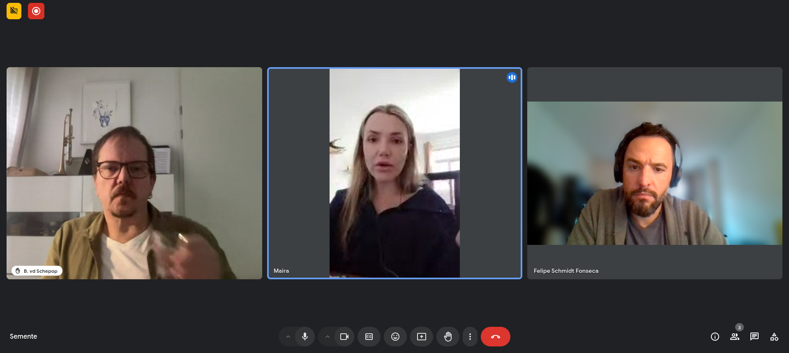

# Workshop #2 - 19/11/2024

Maira, Felipe e Bernardo conversam sobre princípios do projeto: comunidades, circularidade, metáforas e regeneração. Felipe apresentou um rascunho de visualização espiral dos ciclos da semente.

Após o workshop, publicamos um texto sobre possíveis entendimentos sobre comunidades e suas implicações:

- [Community Ways](https://semente.de/lab/community-ways/).

Gravação em vídeo disponível no [Internet Archive](https://archive.org/details/workshop-semente_11-24) and [YouTube](https://www.youtube.com/watch?v=QZ5N1hMrrU4). Transcrição automática disponível em texto simples [aqui](2024-11-19_workshop-transcricao.txt).

## Resumo automático da sessão

A transcrição registra uma oficina da equipe semente, realizada em 19 de novembro de 2024, para discutir o projeto semente e suas próximas etapas. Os participantes Felipe Fonseca, Maira Begalli e Bernardo van de Schepop exploram o conceito do “tabuleiro Semente”, seus possíveis formatos e o desenvolvimento de ferramentas para apoiar projetos comunitários.

A discussão abrange a evolução do projeto semente, desde suas bases e precedentes imediatos (ID21, fonte.wiki, Tropixel 2022) até a concepção de uma nova versão mais interativa e dinâmica. A equipe busca refinar a representação das dinâmicas coletivas, tornando-a mais útil e eficaz para as comunidades com as quais interagem.

Um ponto central da discussão é a definição de comunidade, contrastando visões limitadas (comunidade como clientes, grupo predeterminado ou entidades artificiais das redes sociais) com uma perspectiva mais ampla e inclusiva. A equipe defende uma visão de comunidade como um sistema de múltiplas camadas de relações, onde as identidades individuais são agregadas e fortalecidas.

Outro ponto de destaque é a discussão sobre o propósito da comunidade, que vai além da mera produção de frutos ou resultados tangíveis. A equipe propõe que o objetivo principal seja a perpetuação do grupo e o fortalecimento dos laços entre seus membros, utilizando os frutos como meio para alcançar esse fim.

A metáfora da "bolsa de sementes" é utilizada para representar tanto o grupo de pessoas quanto o objetivo da comunidade, enfatizando a importância da continuidade, reciprocidade, e doação. A equipe também discute a importância de equilibrar a lógica comercial com os valores comunitários, buscando um modelo que permita a sustentabilidade financeira sem comprometer a essência e os objetivos da comunidade. Por fim, também discutem a importância de adaptar a metodologia semente a diferentes contextos e necessidades das comunidades, reconhecendo que não existe uma abordagem única.