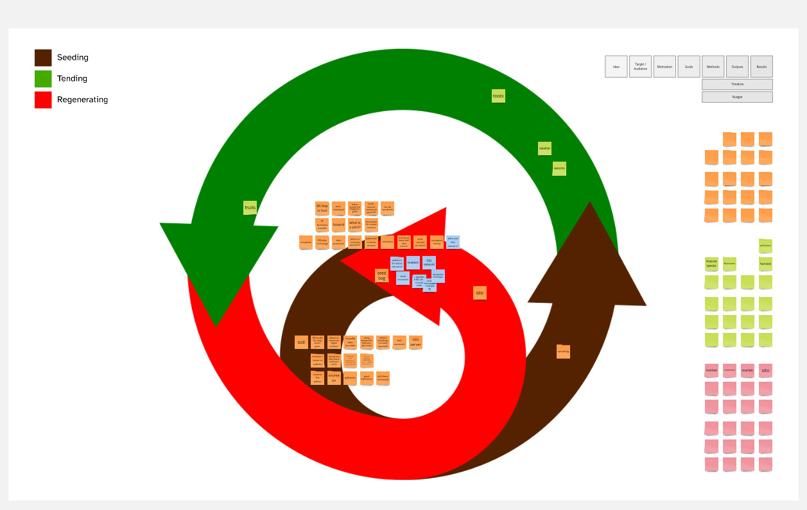

# 20241212 seeding GIG education

*Workshop with 3 members of GIG (Felipe included).*

## Notes by FF after the session

> - It took me too long to finish introducing the vocabulary and get to work. I need a shorter story about semente, focused on the spiral and translating the main concepts. The whole version about cycles should be optional. \[After the session I [edited a video](https://www.youtube.com/watch?v=3Jit6GcCBqQ) about the tension between straight-arrow-shaped projects and semente's spiralled perspective\].
> - While listening to the participants, I identified early on the perspectives they were bringing and where to put notes on the spiral. There's no right or wrong entry point and that's by design. We should explore connections between the cards.

## To change

Some cards can suggest predefined positions but also connections with other cards. Of course, allow users to add their own connections. And name/label these connections.

## Highlights of the conversation

- Commons governance: how? Platform to not only serve GIG members, but be owned collectively. Curatorship of contents and decisions.
- Social innovators, not only makers.
- Social technologies.
- Support for users.

## Longer-form report (FF)

The main proposal for this first session was to start designing the foundations of a collective project idea for GIG and/or a collective of GIG members. I arrived at the idea recently, while thinking of how to push forward an educational spinoff of my PhD research. A part of it would be to create a pilot online course (about the reuse of materials, etc). I first thought of offering the course in one of the many free/freemium e-learning platforms out there, but our old concerns about ownership and sovereignty are all too present in my mind these days. Then I thought of setting up a course environment as I've done some times over the last decades, but having to manage yet another website on my own was not a good prospect.

I reckon it's easy to see where I'm going. When I entertained the idea of having a collectively governed platform for online courses associated with the GIG network, a series of potential benefits emerged:

- Many GIG members are actively involved with a myriad of educational projects, some of them with being particularly experienced in online education.
- Amid the GIG network we have many members with technical knowledge that can easily take on the task of setting up and maintaining an open-source education platform (more on that below).
- A global platform for online education on social innovation can benefit each GIG member by lending international legitimacy for our own local projects. In many cases, claiming that this course we're offering to the community here is part of this international network with makerspaces in every continent will be an asset in an of itself.
- This may be a bit presumptuous, but my feeling is that such a platform could in a short term start generating enough income to reward GIG members responsible for individual courses, to pay for its own costs (including infrastructure, technical personnel and support on instructional design and content creation). It might as well generate surplus to be invested in GIG projects.
- Additionally, it could be a way to tap into sources of funding usually not that directly interested in international cooperation and human rights - I'm talking greentech / edtech / global impact / startup funding. And it could easily establish ties with academia for outreach initiatives, as well as municipalities, national governments, development organisations, industry associations, and so on.

In a sense, this is all a detour of my original intention of creating a course and sharing it somewhere, but I feel it's a valid one. Maybe I'm biased in excitement for reenacted love, but it does seem to be a good idea. Before I left Brazil in 2019, I spent quite a lot of time investigating online education platforms as I had the intention of setting up a project on social-environmental education. It didn't happen then, for a number of reasons. But this setting now seems perfect to unpack it again. And I truly believe that we as a network can fill a menu of courses with a pretty decent offer and start operating quite quickly.

My usual take would be to claim a free tier on a random cloud hosting company, set up an instance of OpenEDX (the open-source software behind MIT's edx.org) and invite everyone to contribute. But I'm too old to be that kind of hero, and would like to dedicate a bit more time to sustainable collective processes. For this reason, I decided to start with this session today. It seems to me very important for a platform like that to be not only something that serves the GIG community, as a service provider. In an exercise of eating our own dog food, this project should be collective and openly governed from the start.

I have to admit that a good part of our conversation today served my purpose of experimenting with the current version of semente as a tool for community projects. At semente we're in the middle of a new stage. It took me perhaps too long to present an introduction deconstructing straight-arrow-shaped projects (and I later made a [video about it](https://www.youtube.com/watch?v=3Jit6GcCBqQ) so I don't need to repeat that introduction in the future). But we soon started laying out ideas. In any case, we had a fantastic meta-conversation about shapes and affordances of project frameworks and a non-linear mindset. Highlights are below:

- Platforms like udemy offer, besides the e-learning environment, good resources to support course creators. Templates, manuals, video suggestions.
- A reflection about the interoperability of contents. How to integrate and strive for content permanence (many of us have been involved with projects that created online courses which disappeared over time for lack of funding or changes in political tides)?
- Focus not only on makers, but "social innovators" more widely. Cater to GIG members doing important work, beyond only "making".
- What technology should we use? What is a good pilot/prototype/MVP? (FF adds after the session - running [openedx](https://openedx.org/) with [tutor](https://docs.tutor.edly.io/) seems a good balance of openness and good feature set / interface OOTB, but we should study about its long-tem dependability, persistence and integration).
- What is the governance model? Who owns this project? What would be a commons approach? Especially as the project can become an income stream, it's important to define roles. How do we frame? What contents?  (FF adds after the session - I imagine this requires a lot more thought, but can envision a semi-formal collective body acting as rotative, time-bound board for course curation and decision-making. Perhaps inspired by platcoop formats, though not necessarily 100% that).