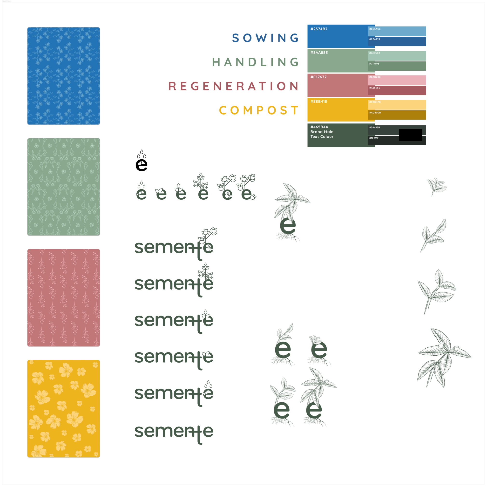

# Visual Identity

semente's visual identity was updated in 2025 to become more versatile and flexible.

In February 2024, the semente team hosted a workshop presenting the initial phases of development of the toolkit and its visual identity - including the reference to the _Ingá_ tree, used as a first measure for forest regeneration in areas of Atlantic Forest in Brazil. The workshop (in Portuguese) is available from [archive.org](https://archive.org/details/semente-identidade-comunicacao) and [YouTube](https://www.youtube.com/watch?v=ISYXjBHd8gs).

## See also

- semente's visual identity documentation is available on [Figma](https://www.figma.com/design/ypCip3jSUu2Halyg2gG32e/semente-identity-v4?node-id=83-1136&t=CmIVOCiNbMv7GMXK-1) (identity v.4) and [miro](https://miro.com/app/board/uXjVIEuVadM=/) (previous versions and initial research).