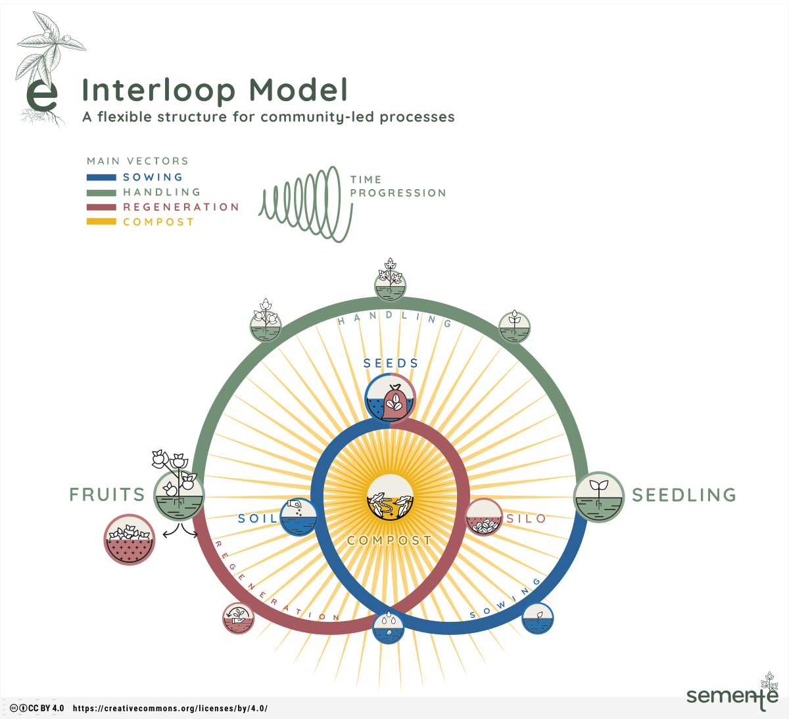

# Interloop

The interloop (_entrelaço_, in Portuguese) is semente's playing field. It helps communities visualise not only the start and end of their projects, but also (and fundamentally) everything that needs to happen before the first sprouts and after the fruits are harvested.

The interloop has three sequential vectors, moving counter-clockwise from the centre: _Sowing_, _Handling_, and _Regeneration_. The main elements of semente are disposed along that path:

- The _Seed_ - a combination of people and groups, and their intentions, desires, dreams;
- _Soil_ - everything that the group builds on whenever a new initiative starts - past experience, legacy, available infrastructure and knowledge, etc)
- _Sprout_ - the first expression of the project, which may take the form of a prototype, a MVP, an agreed description of grant application.
- _Fruits_ - the concrete and explicit outputs of collective construction, which can be traded in the market or kept for future use.
- The _Silo_ - where shared values and principles are collected among the harvest to generate new seeds.

It's important to emphasise that the interloop is spiralled and progressive. In other words, at the end of the cycle new seeds are generated, but they are not exactly the same as the initial seeds. Time has passed, the whole system was put in motion, and a new generation of seeds has emerged.

The interloop can be approached from any point. A group willing to use it can start defining the concrete fruits, or analysing the soil they can ground their plans on. They can discuss the silo - their shared values and principles. That is, there is no predefined order to use semente. The important is to understand the whole cycle and its constitutive dynamics.

At any point in the cycle, the group can make use of the composter. It's meant to temporarily hold the decisions yet to be made, the requirements and conditions that are not yet ideal, or the need to achieve consensus on particular topics.

An interactive version of the interloop can be accessed on [Figma](https://www.figma.com/design/AILcWjAeOrk6CDak08Ky9v/semente-entrela%C3%A7o-FF-simplificado?node-id=0-1&p=f&t=9jUDs8mcJH0QhGsi-0).

In addition to visualising the elements of the interloop cycle and their relationships, semente also offers [sets of cards](../cards) to activate deeper levels of conversation, discussion and planning.